<h2>⚠️ DISCLAIMER  </h2>
✦ Este proyecto es de aprendizaje, por lo que hay mucho margen de mejora, tanto en el código como en el apartado visual y funcional.
 
✦ Los WebP y GIF utilizados para mostrar el funcionamiento de la aplicación han sido optimizados para reducir su tamaño y mejorar el tiempo de carga, por lo que pueden reproducirse ligeramente más despacio que los vídeos originales.
 
✦ Los números de seguidores, «me gusta» y comentarios son aleatorios para no tener que crear demasiadas cuentas.
 
✦ Todas las imágenes, tanto las de cada usuario como las de perfil, están creadas utilizando IA.

<h1>AQUIM — Red Social de Imágenes Horizontales</h1>

  

    
  

  

    
  

<h1> 📌 Descripción </h1>
AQUIM es una red social donde todo tu mundo creativo se reúne en un mismo ecosistema. Un espacio tranquilo para explorar imágenes horizontales, descubrir nuevas ideas e inspirarte con fotografías de viajes, paisajes, gastronomía, creatividad y momentos cotidianos.

Crea tu perfil, comparte tu propia mirada y conecta con personas que tienen intereses similares. Sigue a otros usuarios, interactúa mediante «Me gusta» y comentarios, y forma parte de una comunidad donde las imágenes son las verdaderas protagonistas.

Cada publicación es una oportunidad para mostrar una experiencia, contar una historia o compartir aquello que te inspira. AQUIM reúne diferentes formas de ver el mundo en un entorno pensado para descubrir contenido con calma, dejarse llevar por nuevas ideas y encontrar inspiración en los pequeños y grandes momentos.

Su diseño da protagonismo a las imágenes y facilita una experiencia sencilla, relajada y cercana. Tanto si quieres compartir tus fotografías como si prefieres explorar las creaciones de otras personas, siempre encontrarás un espacio donde expresarte, inspirarte y conectar con la comunidad.

**Explora, comparte y conecta. Todo tu mundo creativo, en un mismo ecosistema.**

<h1> 🛠️ Tecnologías usadas </h1>

       

<h1> 🖼️ Demostración y Funcionalidades </h1>

A continuación, se detalla el funcionamiento principal de AQUIM, desde el descubrimiento de nuevas publicaciones hasta la interacción entre los miembros de la comunidad.

<h2> 🏠 Pantalla de Inicio </h2>

Vista principal de la plataforma, donde el usuario puede descubrir publicaciones recientes y recorrer imágenes horizontales en un entorno visual, limpio y relajado.
  
 ㅤ
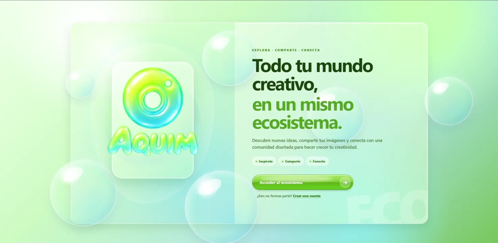

  
  

<h2>  🧭 Navegación y menús</h2>

AQUIM cuenta con diferentes elementos de navegación que permiten acceder rápidamente a las principales funciones de la plataforma, consultar la actividad reciente y visualizar información básica de la cuenta.

<h3> ✦ 🔝Navbar principal</ins> </h3>
Desde la barra superior se puede acceder al buscador, subir nuevas imágenes y abrir un menú con los principales accesos de la plataforma, ofreciendo las mismas opciones disponibles en el menú lateral.

<h3> ✦ ☰ Menú lateral izquierdo </h3>
El menú lateral permite acceder al inicio, al espacio personal, a la edición del perfil y al cierre de sesión.

<h3> ✦ 📊 Estadisticas de usuario </h3>
El usuario puede consultar el número total de imágenes publicadas y la calidad del aire de su perfil, un indicador que aumenta cuanto más interactúa en la plataforma y disminuye durante los periodos de inactividad.

<h3> ✦ 🕒 Menú y paneles del usuario </h3>
Estos paneles muestran la actividad reciente de las cuentas seguidas y diferentes estadísticas relacionadas con el perfil del usuario.
  
ㅤ

&nbsp;&nbsp;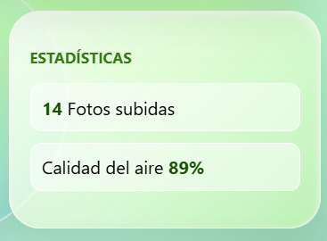&nbsp;&nbsp;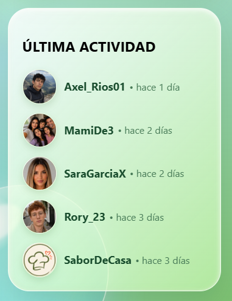

  
  

<h2> 🫧 Burbujas</h2>
Toda la página cuenta con un fondo animado compuesto por 6 burbujas en movimiento suave, aportando un aspecto más dinámico y visual.
  
 ㅤ

  
  

 
<h2> 🔔 Notificaciones</h2>
El sistema muestra diferentes notificaciones según la acción realizada, informando al usuario sobre confirmaciones, cambios y errores dentro de la plataforma.
  
 ㅤ

  
  

<h2> 🔐 Autenticación y Seguridad</h2>
El sistema incluye registro, inicio de sesión, recuperación de contraseña, gestión de sesiones y verificación en dos pasos mediante Laravel Jetstream y Fortify.
  
 ㅤ
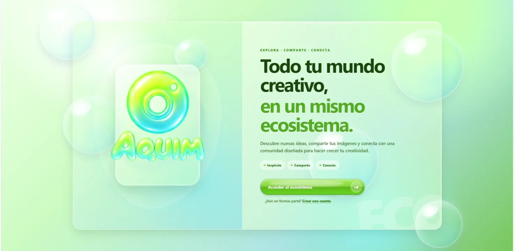
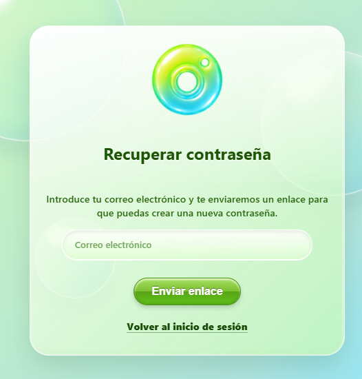

  
  

<h2> 📰 Feed con Publicaciones Horizontales</h2>
Las imágenes se muestran en formato panorámico para aprovechar mejor el espacio disponible y mantener la fotografía como protagonista. Cada publicación puede incluir una descripción, su autor y la información de interacción de la comunidad.
  
 ㅤㅤ
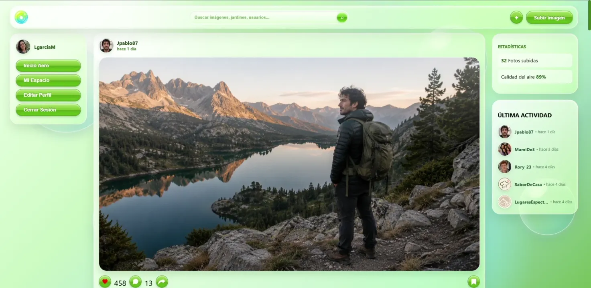

  
  

<h2> ⬆️ Subir Imagen**  </h2>
Desde este modal, el usuario puede seleccionar una imagen, ajustarla al formato horizontal 16:9, añadir una descripción y publicarla directamente en la plataforma.
  
 ㅤ
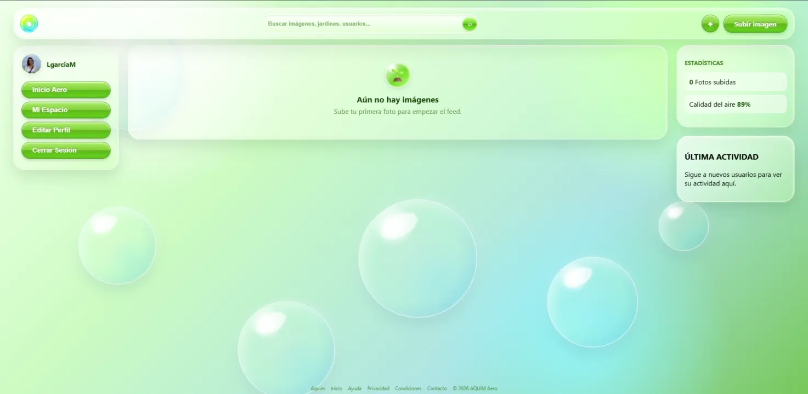

  
  

 

<h2> 👤 Perfiles de Usuario**  </h1>
Cada usuario dispone de un perfil público desde el que puede mostrar sus publicaciones, información personal y actividad dentro de la plataforma.

<h3> ✦ 🗂️ Feed del usuario </h3>
El perfil muestra todas las publicaciones compartidas por el usuario, permitiendo consultar fácilmente su contenido desde un mismo lugar.
  
 ㅤ
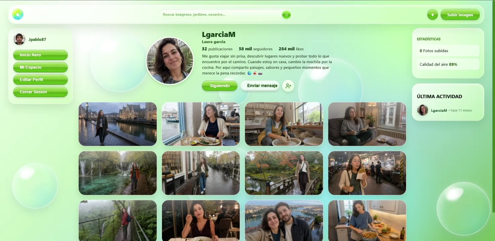

<h3> ✦ ✏️ Editar descripción del usuario </h3>
El usuario puede editar la descripción visible de su perfil para actualizar la información que quiere compartir con el resto de la comunidad.
  
 ㅤ
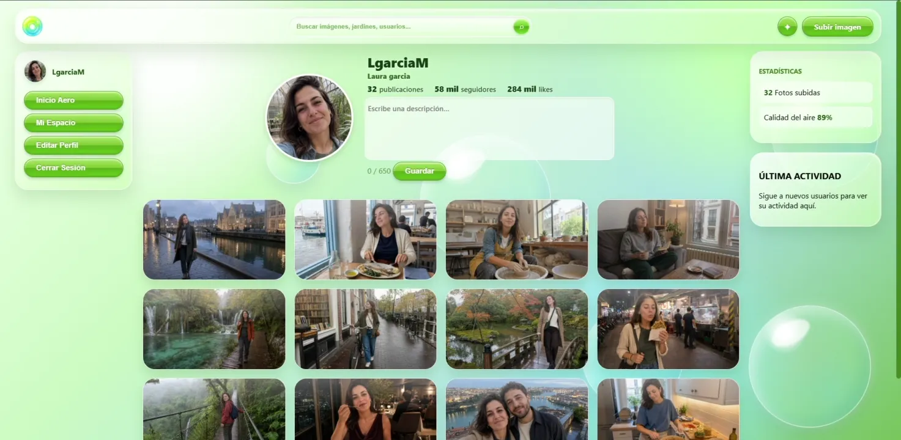

  
  

<h2> 🖼️ Imagen unitaria</h2>
  
 ㅤ
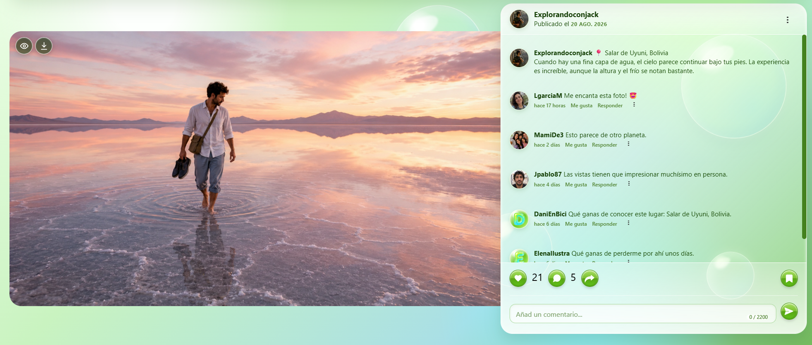

<h3> ✦ 📝 Editar descripción de la imagen </h3>
El propietario de la imagen puede modificar su descripción en cualquier momento para actualizar o corregir la información de la publicación.
  
 ㅤ
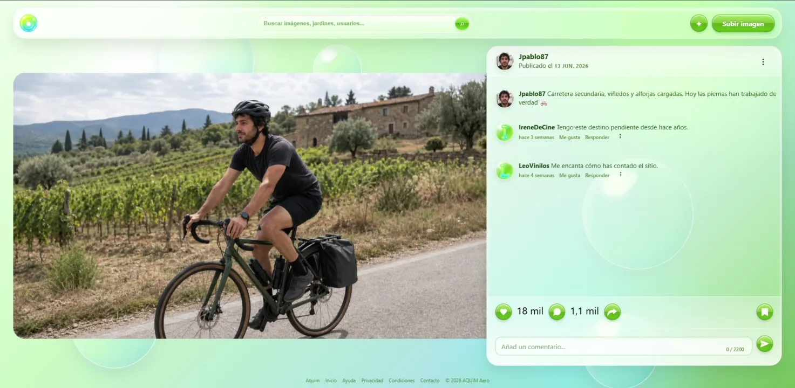

<h3> ✦ 🗑️ Eliminar imagen </h3>
El propietario puede eliminar definitivamente una de sus imágenes cuando ya no quiera mantenerla publicada en AQUIM.
  
 ㅤ
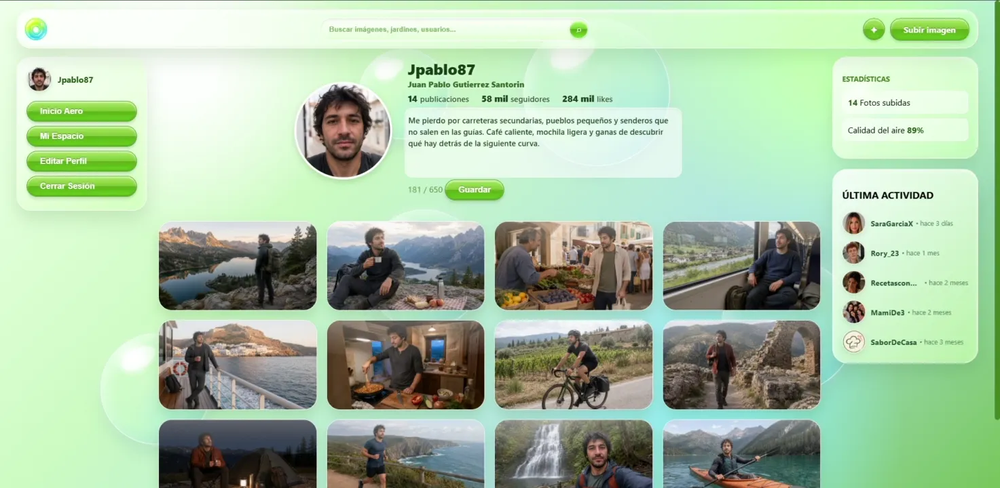

<h3> ✦ 🧹 Eliminar comentarios </h3>
El usuario puede eliminar sus propios comentarios. Además, si la imagen le pertenece, también puede eliminar los comentarios realizados por otros usuarios en su publicación.
  
 ㅤ
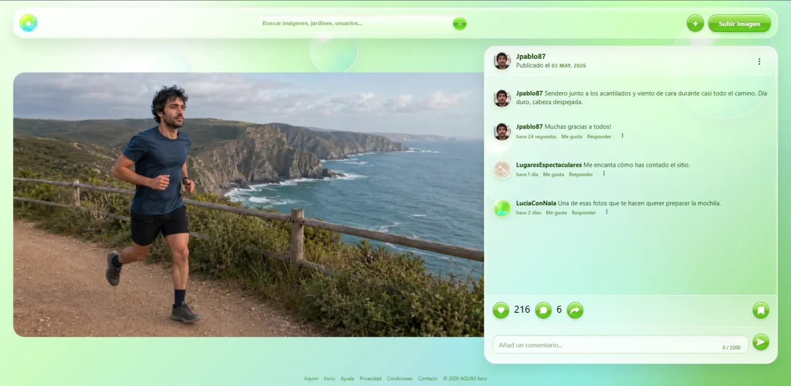

<h3> ✦ 👁️ Vista en grande y descarga </h3>
Al pasar el cursor sobre la imagen aparecen dos botones: uno permite abrirla en una vista ampliada para observarla con mayor detalle y el otro permite descargarla en su calidad original.
  
 ㅤ
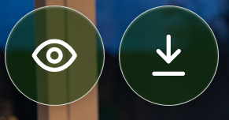

  
  

<h2> 🫂 Interacción y Comunidad</h2>
Los usuarios pueden indicar que les gusta una publicación, escribir comentarios y seguir otras cuentas. Estas funciones permiten descubrir nuevos perfiles y crear una comunidad alrededor de intereses visuales compartidos.

<h3> ✦ ➕ Seguir al usuario </h3>
Permite seguir o dejar de seguir otros perfiles para descubrir sus publicaciones y mantenerse al día con su actividad.
  
 ㅤ
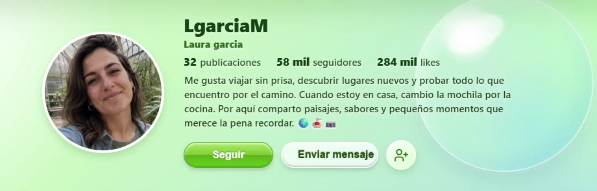

 <h3> ✦ 💓 Boton de megusta </h3>
El usuario podrá dar o quitar “Me gusta” en una publicación tanto en el feed como en la imagen unitaria.
  
 ㅤ

  
 <h3> ✦ 💬 Comentarios </h3>
Consulta los comentarios de la publicación y participa añadiendo el tuyo.
  
ㅤ
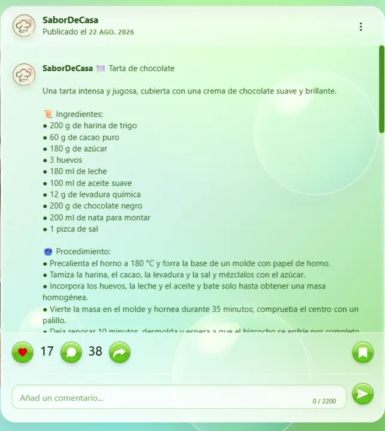
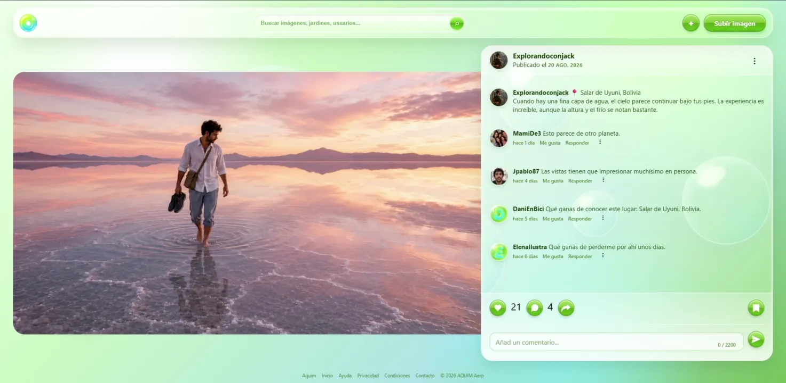

  
  

<h2> 🔍 Buscador en Tiempo Real</h2>
El buscador permite localizar perfiles mientras se escribe y acceder rápidamente a otros usuarios sin abandonar la navegación principal de la plataforma.
  
 ㅤ
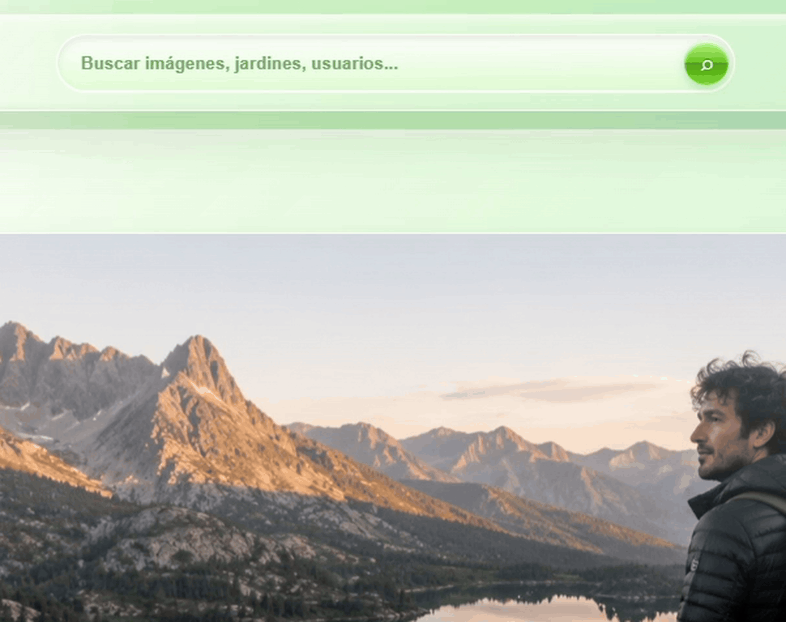

  
  

<h2> 📋 Edicion del usuario</h2>
Desde esta sección, el usuario puede gestionar las principales opciones de su cuenta: cambiar o eliminar la foto de perfil, modificar el nombre, el nick y el correo electrónico, actualizar la contraseña, administrar la verificación en dos pasos, cerrar las sesiones abiertas en otros dispositivos y eliminar definitivamente su cuenta.
  
 ㅤ
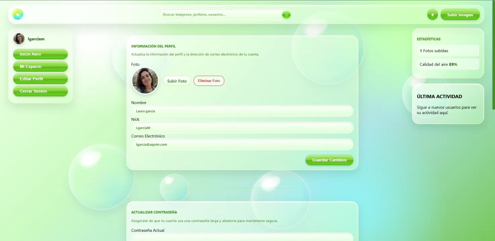

<h3> ✦ 🙍🏻 Ediatr foto de perfil y nombre </h3>
La foto de perfil y el nombre pueden modificarse directamente sin necesidad de introducir la contraseña del usuario.
  
 ㅤ
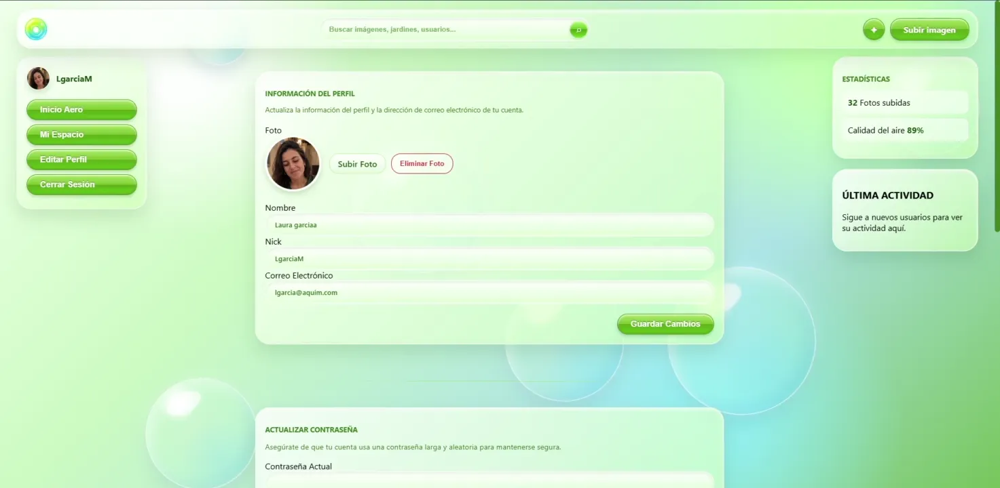

<h3> ✦ 📧 Editar el nick o el email </h3>
Para cambiar el nick o el correo electrónico, el usuario debe introducir su contraseña actual como medida de seguridad.
  
 ㅤ
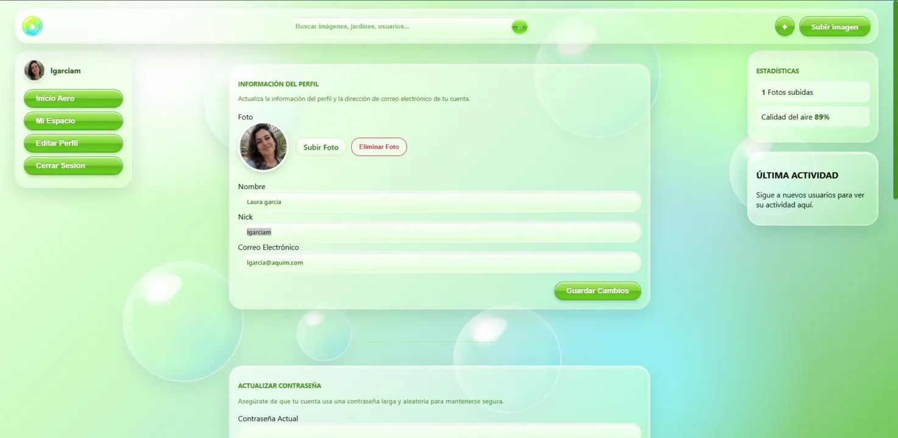

<h3> ✦ 🔠 Avatar automático por inicial </h3>
Si el usuario no tiene una imagen de perfil, se le asignará automáticamente una imagen con la primera letra de su nombre.
  
 ㅤ

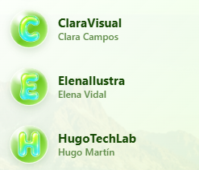

 

  
  

<h2> 🪧 Manejo de errores de la aplicacion</h2>
AQUIM muestra distintos mensajes de error cuando una acción no puede completarse, indicando al usuario qué ha ocurrido.
  
 ㅤ

  
  
 
<h2> 📱 Diseño Responsive</h2>
La interfaz se adapta a ordenadores, tabletas y teléfonos móviles. La distribución de las imágenes, los perfiles, los comentarios y los menús cambia según el tamaño y la orientación de la pantalla.

    ㅤ
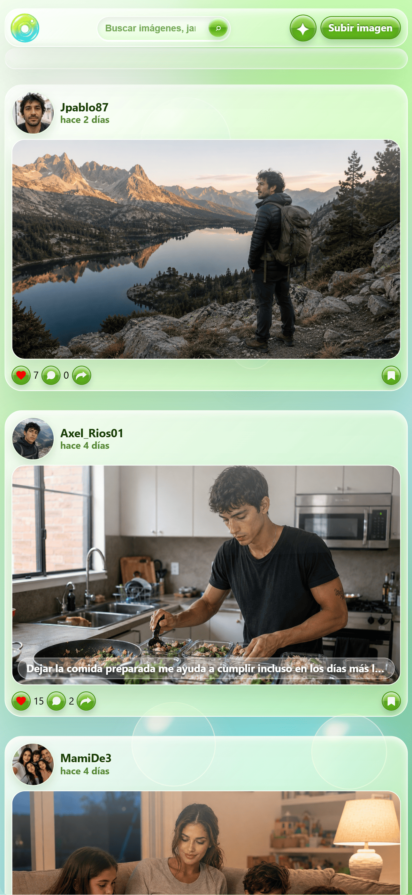
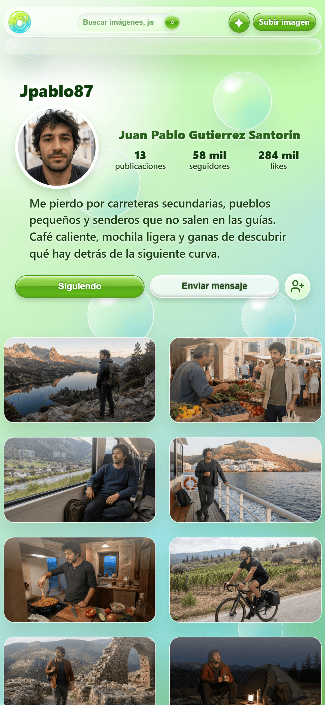
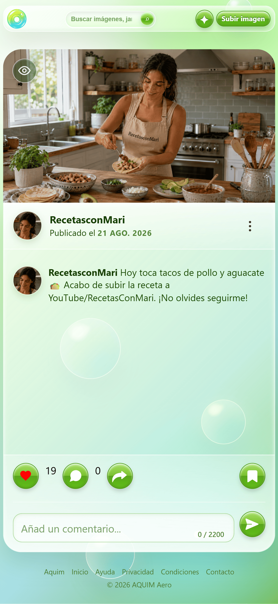

  
  
  

<h1> 🚀 Cómo ejecutarlo </h1>

Para levantar AQUIM en tu entorno local con **Laravel Herd** y una base de datos MySQL proporcionada por **WampServer**, sigue estos pasos:

1. **Instala los programas necesarios:** Instala Laravel Herd, Node.js y WampServer. Herd se utilizará como servidor local de Laravel y WampServer únicamente para mantener activo el servicio MySQL.
2. **Prepara el proyecto:** Abre una terminal en la carpeta raíz de AQUIM e instala las dependencias con `composer install` y `npm install`. Después, crea el archivo de configuración con `copy .env.example .env` y genera la clave mediante `php artisan key:generate`.
3. **Crea la base de datos:** Inicia MySQL desde WampServer, abre phpMyAdmin o tu gestor habitual y crea una base de datos vacía llamada `aquim`.
4. **Configura la conexión:** Abre el archivo `.env` y utiliza `DB_CONNECTION=mysql`, `DB_HOST=127.0.0.1`, `DB_PORT=3306`, `DB_DATABASE=aquim`, `DB_USERNAME=root` y la contraseña configurada en tu instalación.
5. **Prepara Laravel:** Ejecuta `php artisan migrate` para crear las tablas y `php artisan storage:link` para permitir el acceso público a las imágenes almacenadas.
6. **Abre AQUIM:** Ejecuta `herd link aquim` desde la carpeta del proyecto, inicia Vite con `npm run dev` y entra en [http://aquim.test](http://aquim.test). También puedes abrirlo con `herd open`.

> Si Apache de WampServer entra en conflicto con Herd, detenlo y deja activo únicamente MySQL. No es necesario ejecutar `php artisan serve`, ya que Herd se encarga de servir la aplicación.
